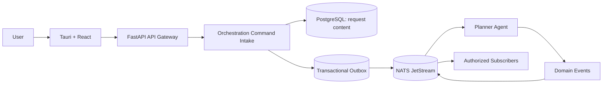
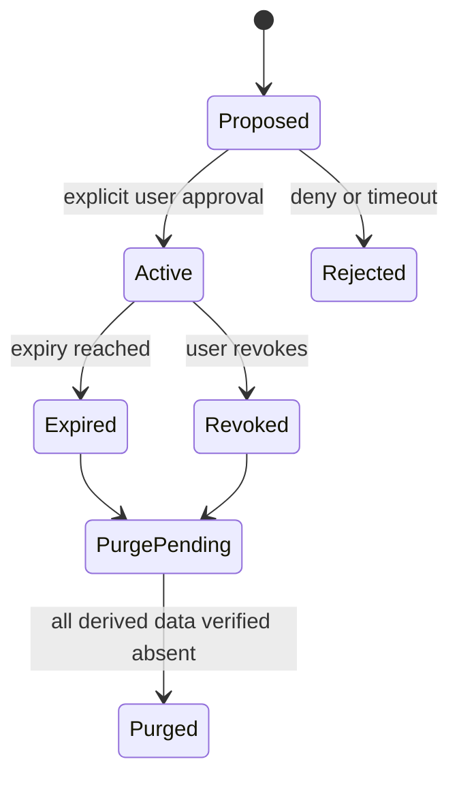
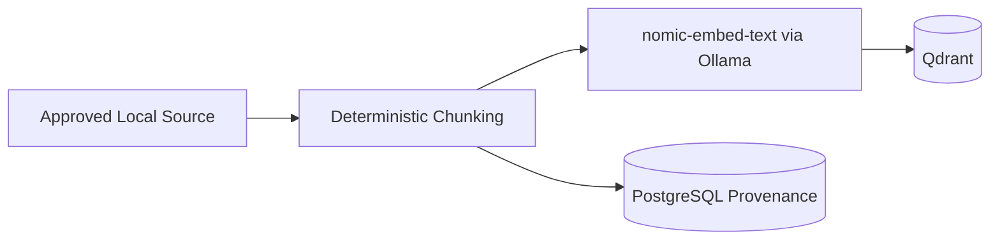

# JDOS v1.2 Architecture Corrections Addendum

**Document version:** 1.2  
**Effective date:** 2026-06-07  
**Status:** Architecture correction baseline  
**Source:** JDOS v1.0 architecture audit and JARVIS PRD v1.1  
**Scope:** Documentation and contracts only

## Purpose and Authority

This addendum resolves the ten findings raised by the JDOS v1.0 architecture audit. It preserves all accepted architecture decisions and the approved local technology stack. Where a JDOS v1.0 document conflicts with this addendum, this addendum controls until the affected document is revised.

The following remain non-negotiable:

- Local-first, privacy-first, and offline-first operation.
- Event-driven integration through NATS Core and JetStream.
- Tauri, React, TypeScript, and Tailwind.
- Python 3.12 and FastAPI.
- PostgreSQL, Redis, and Qdrant.
- Ollama with Qwen 3 8B, Qwen Coder, Qwen2.5-VL, and `nomic-embed-text`.
- OpenWakeWord, Faster-Whisper, and Piper.
- Clean/hexagonal boundaries, service-owned persistence, least privilege, and explicit user control.

No cloud AI, cloud database, cloud memory, cloud embedding, cloud storage, or automatic external transfer is authorized.

## Correction 01: Command Architecture

Commands request future action and have exactly one owning handler. Events describe completed facts and may have multiple subscribers.

### Command Registry

| Command | Owning handler | Purpose |
|---|---|---|
| `USER_REQUEST_COMMAND` | Planner Agent | Accept a referenced user request and produce a validated plan under Core governance |
| `SHOW_NOTIFICATION_COMMAND` | Notification Service | Deliver an approved notification |
| `UPDATE_WALLPAPER_COMMAND` | Wallpaper Engine | Apply an approved local wallpaper state |
| `CREATE_MEMORY_COMMAND` | Memory Service | Persist a consent-backed memory |
| `START_RESEARCH_COMMAND` | Research Agent | Start research over approved source scopes |
| `OPEN_APPLICATION_COMMAND` | Automation Agent | Open one allowlisted application under a capability grant |

The JARVIS Core Agent remains orchestration authority. It governs lifecycle, policy, approval, cancellation, and compensation. Command ownership identifies the single component permitted to acknowledge and execute that command; it does not grant independent authority.

### Event Registry

The corrected core factual events are:

- `USER_REQUEST_RECEIVED`
- `MEMORY_CREATED`
- `MEMORY_UPDATED`
- `RESEARCH_STARTED`
- `RESEARCH_COMPLETED`
- `APPLICATION_OPENED`

Additional factual lifecycle events may be registered before implementation. `NOTIFICATION_SHOW` and `WALLPAPER_UPDATE` are retired as event names and replaced by `SHOW_NOTIFICATION_COMMAND` and `UPDATE_WALLPAPER_COMMAND`. Successful handlers may later emit `NOTIFICATION_SHOWN` and `WALLPAPER_UPDATED`.

## Correction 02: Gateway to NATS CQRS Flow



The API Gateway authenticates, validates, rate-limits, assigns correlation and idempotency identifiers, and invokes the Orchestration Command Intake port. The intake transaction stores sensitive request content in the `orchestration` PostgreSQL schema and writes a reference-only `USER_REQUEST_COMMAND` to its outbox. The Gateway never invokes the Planner or Core Agent directly.

The Planner Agent is the sole handler of `USER_REQUEST_COMMAND`. It retrieves request content through an authorized Orchestration query port, creates a typed plan, and emits factual lifecycle events. Core governs the overall request state and subsequent command dispatch.

Queries may use synchronous authenticated APIs when bounded and side-effect free. Mutating cross-boundary work uses commands and events.

## Correction 03: Memory Consent Architecture

Durable memory requires explicit, active consent. Every memory record contains at minimum:

- `memory_id`
- `consent_id`
- `source`
- `created_at`
- `retention_policy`

### Consent Record

| Field | Requirement |
|---|---|
| `consent_id` | UUIDv7 primary identifier |
| `subject_id` | Local user identity |
| `purpose` | Specific approved memory purpose |
| `scope` | Memory types and source boundaries |
| `status` | `active`, `revoked`, or `expired` |
| `granted_at` | RFC 3339 UTC |
| `expires_at` | Nullable RFC 3339 UTC |
| `revoked_at` | Nullable RFC 3339 UTC |
| `request_id` | Originating request reference |
| `policy_version` | Consent-policy version |



Revocation prevents retrieval immediately, starts an idempotent purge job for memories covered only by that consent, removes vectors and caches, and records a content-free audit fact. Consent audit records contain IDs, decision metadata, policy version, timestamps, and result; they never contain memory text.

See `memory_architecture.md`, `database_strategy.md`, and `api_contracts.md`.

## Correction 04: Embedding Architecture

`nomic-embed-text` is the approved embedding model. It runs locally through Ollama. Cloud embedding services and fallback APIs are prohibited.



Every vector records source ID, source revision, chunk hash, model ID, model digest, dimensions, sensitivity, and retrieval scope. Indexes are rebuilt when incompatible model or dimension changes occur. Source content remains governed by its owning service.

## Correction 05: Sensitive Event Policy

Durable commands and events MUST NOT contain:

- User prompts or transcripts.
- Research queries.
- Personal content.
- Documents or document chunks.
- Memory text.
- Raw audio, images, screenshots, credentials, or secrets.

They contain opaque IDs, authorized resource references, classification, purpose, version, and safe operational metadata only.

Bad:

```json
{"query": "Research LangGraph"}
```

Good:

```json
{"request_id": "01975c2f-4aef-7cf1-a940-ae54bf596280"}
```

Consumers retrieve content through an authenticated, purpose-limited query port after policy evaluation. Event access does not imply content access.

## Correction 06: Backup Security Policy

Backups include:

- PostgreSQL data.
- Qdrant collections or verified rebuild metadata.
- User settings.
- Consent-backed memory data.

Backups exclude:

- API keys, tokens, secrets, and credentials.
- `.env` files.
- OS credential-manager contents.
- Redis data.
- Temporary media and caches.

Backups are encrypted locally with an authenticated encryption scheme and a user-controlled recovery key that is not stored inside the backup. Recovery restores into an isolated target, verifies manifest signatures/checksums, schema and model compatibility, reapplies deletion tombstones and consent revocations, and only then performs an atomic switchover.

## Correction 07: Settings Service Ownership

The Settings Service owns user settings, feature flags, runtime configuration, and personal preferences.

- Database owner: `settings` PostgreSQL schema.
- API owner: `/v1/settings`.
- Event owner: factual settings lifecycle events.
- Secrets are references to OS credential storage, never settings values.
- Runtime safety constraints cannot be weakened through ordinary user settings.

## Correction 08: Audit Service Ownership

The Audit Service owns security audit records, consent audit records, system actions, policy decisions, and administrative events.

- Database owner: append-only `audit` PostgreSQL schema.
- Storage: tamper-evident hash-chained records with content-minimized fields.
- Access: local authenticated user through a redacted query API; agents have no general read access.
- Retention: user-configurable above a security minimum; consent revocation and deletion facts remain content-free.
- Audit ingestion failure causes sensitive actions to fail closed where an audit record is mandatory.

## Correction 09: Model Verification

Phase 01 verifies:

- Qwen 3 8B.
- Qwen Coder.
- Qwen2.5-VL.
- `nomic-embed-text`.

Verification covers local installation, approved manifest and digest, license metadata, offline availability, Ollama startup discovery, a deterministic smoke inference, and failure behavior when a model is unavailable.

## Correction 10: NATS Governance

### Stream Classes

| Stream class | Purpose | Retention baseline |
|---|---|---|
| `JARVIS_COMMANDS_V1` | Durable action requests | Work-queue retention; bounded by acknowledgement and dead-letter policy |
| `JARVIS_EVENTS_V1` | Durable domain facts | Limits retention; 30-day default, user configurable |
| `JARVIS_AUDIT_SIGNALS_V1` | Reference-only audit ingestion signals | Limits retention; 7-day delivery buffer |
| NATS Core subjects | Ephemeral progress and UI state | No persistence |

### Governance Rules

- Default maximum serialized message size is 256 KiB; production configuration MUST enforce it.
- Commands have one owning durable consumer. Events may have multiple named durable consumers.
- Consumers use explicit acknowledgements, bounded exponential backoff with jitter, and idempotency.
- Default delivery attempts are 5 before routing a reference-only failure record to `jarvis.dlq.<domain>.v1`.
- Dead-letter ownership belongs to the original command/event owning service; Security and Audit receive metadata-only signals.
- Stream access uses least-privilege NATS accounts and subject permissions.
- Durable payloads follow the Sensitive Event Policy.
- Stream retention does not replace PostgreSQL business state or Audit retention.
- Replay requires local authorization, reason, correlation ID, and audit record.

## Correction Closure Matrix

| Audit finding | Corrective authority |
|---|---|
| Direct Gateway to Core mutation | CQRS flow and Orchestration Command Intake |
| Commands mixed with events | Command Architecture and corrected contracts |
| Missing memory consent | Memory Consent Architecture and API schema |
| Missing embedding model | `nomic-embed-text` Embedding Architecture |
| Sensitive NATS payloads | Sensitive Event Policy |
| Backup secret ambiguity | Backup Security Policy |
| Undefined Settings ownership | Settings Service Ownership |
| Undefined Audit ownership | Audit Service Ownership |
| Missing model verification | Phase 01 Model Verification Checklist |
| Incomplete NATS operations | NATS Governance |

## Remaining Controlled Decisions

Exact pinned software/model versions, model digests, platform-specific backup cryptography implementation, stream storage quotas, and measured retention/resource limits remain Phase 01 decisions. They may refine this baseline through ADRs but cannot weaken its privacy, offline, ownership, or contract rules.

