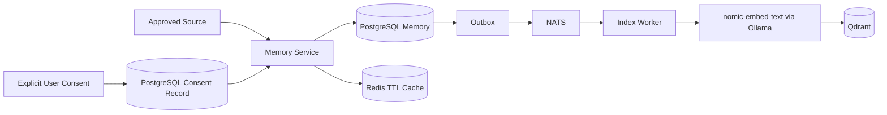
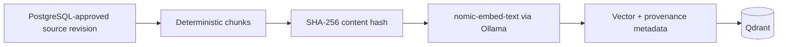

# Memory Architecture

**Architecture version:** 1.2

## Purpose

Memory is consent-backed, local, inspectable, and deletable. PostgreSQL is authoritative, Qdrant is derived, and Redis is ephemeral.

## Data Roles

- **PostgreSQL:** memory content, revisions, provenance, consent, retention, purge jobs, and outbox/inbox.
- **Qdrant:** semantic vectors derived from approved content.
- **Redis:** session context, bounded caches, and short-lived coordination; never durable memory.
- **Ollama:** local execution of `nomic-embed-text`.

## Memory Consent Architecture

Durable memory cannot enter `Active` state without an active consent record matching purpose, scope, source, sensitivity, and retention.

Every memory record includes `memory_id`, `consent_id`, `source`, `created_at`, `retention_policy`, content classification, revision, and provenance.

### Consent Lifecycle

1. A request proposes purpose, scope, retention, and source.
2. The user explicitly approves or denies it.
3. The Memory Service stores the consent record.
4. `CREATE_MEMORY_COMMAND` references both the content resource and active `consent_id`.
5. Consent expiry or revocation blocks retrieval immediately.
6. Covered memories enter purge unless another valid consent basis exists.
7. Audit stores the decision and purge result without memory content.

## Embedding Architecture

Embedding requirements:

- Local execution only; no cloud embedding or fallback.
- Model identity and digest are stored with each index generation.
- Restricted content is not embedded by default.
- Vector payloads contain the minimum text needed for retrieval.
- Retrieval enforces owner, purpose, sensitivity, and consent status.
- Incompatible model/dimension changes use shadow collections and alias swap.

## Retrieval

The Memory Service validates actor, purpose, scope, active consent, and sensitivity before relational or vector retrieval. Qdrant results are resolved back to the current PostgreSQL revision; stale or revoked results are discarded.

## Update and Deletion

Updates create revisions and trigger derived-index replacement. Deletion or consent revocation:

1. Denies further access.
2. Creates an idempotent purge job.
3. Deletes Qdrant vectors.
4. Invalidates Redis keys.
5. Removes local derived artifacts.
6. Physically purges relational content after any documented undo window.
7. Records a content-free audit fact.
8. Applies deletion tombstones during future backup restoration.

