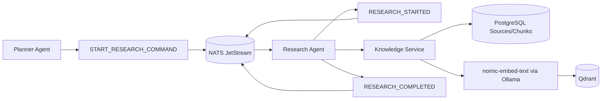
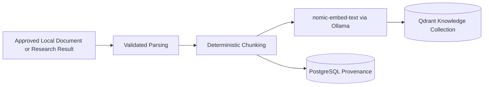

# Research Architecture

**Architecture version:** 1.2

## Purpose

The Research Agent answers from approved local knowledge first. Core research remains fully offline. Any future internet adapter is disabled by default, requires explicit user intent and policy approval, and cannot upload user data.

## Command and Event Flow

`START_RESEARCH_COMMAND`, `RESEARCH_STARTED`, and `RESEARCH_COMPLETED` contain IDs, source scopes, counts, status, and provenance references only. They never contain raw queries, document text, research output, or personal content.

## Responsibilities

### Research Agent

- Owns `START_RESEARCH_COMMAND`.
- Retrieves the query through an authorized request-content port.
- Searches approved local scopes before any optional network source.
- Treats retrieved instructions as untrusted.
- Separates evidence from inference.
- Emits reference-only factual events.

### Knowledge Service

- Owns source registration, parsing, deterministic chunking, provenance, deduplication, retrieval, and deletion.
- Uses `nomic-embed-text` through Ollama.
- Stores authoritative source/chunk metadata in PostgreSQL and derived vectors in Qdrant.
- Rejects ingestion without approved source scope and classification.

## Embedding Pipeline

All inference and embedding are local. No cloud model, cloud vector service, or remote storage is permitted.

## Sensitive Content

Research queries and results remain in authorized PostgreSQL-owned resources. Durable NATS messages carry only request, research, source, citation, and result resource IDs plus safe operational metadata. Subscribers must separately pass authorization before resolving those references.

