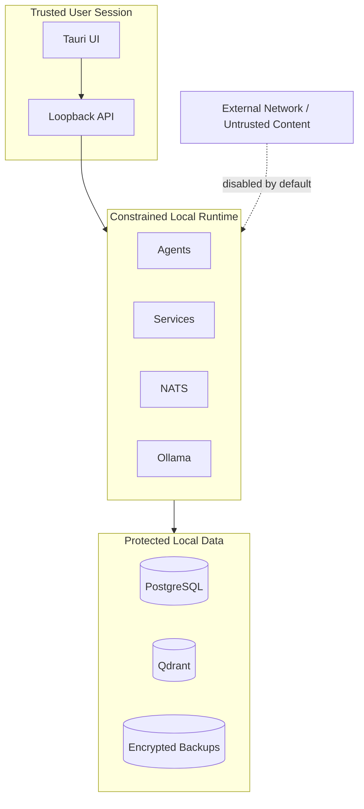

# Security and Privacy Architecture

**Architecture version:** 1.2

This document is governed by the
[`JDOS v1.2 Corrections Addendum`](JDOS_v1.2_Architecture_Corrections_Addendum.md).

**Baseline:** Threat-informed, deny-by-default, single-user local deployment.

## Trust Boundaries

OS processes, model output, imported documents, plugins, and any future network content are untrusted inputs. Local placement does not imply trust.

## Security Principles

- Least privilege and explicit capability grants.
- Deny by default for filesystem, process, sensor, and network access.
- Defense in depth across UI, API, orchestration, tool adapters, and OS controls.
- Validate at every trust boundary using typed schemas.
- Separate policy decisions from policy enforcement.
- Human confirmation for irreversible, sensitive, or materially consequential actions.
- Secrets never enter prompts, events, logs, vector indexes, or source control.
- Security controls remain effective offline.

## Privacy Principles

- Data minimization: collect only what a requested feature needs.
- Purpose limitation: do not reuse data without explicit user intent.
- Local persistence only.
- No automatic upload, analytics, crash reporting, synchronization, or cloud fallback.
- Visible capture state for microphone, screen, camera, and clipboard.
- User-accessible inspection, export, correction, retention, and deletion.
- Raw audio, screenshots, and camera frames are ephemeral unless explicitly saved.
- Derived data inherits the highest sensitivity of its sources.

## Sensitive Event Policy

Durable NATS commands and events contain opaque IDs, resource references,
classification, purpose, versions, and safe operational metadata only. They
MUST NOT contain user prompts, transcripts, research queries, personal content,
documents, chunks, memory text, raw media, credentials, tokens, or secrets.

Consumers resolve references only through an authenticated service query port
after actor, purpose, scope, consent, and classification checks. Subscription to
an event subject does not grant access to referenced content. Dead-letter and
replay records follow the same restrictions.

## Capability Model

Every agent tool call includes:

- Principal: user, service, or agent identity.
- Capability: specific operation such as `filesystem.read`.
- Scope: approved paths, applications, hosts, or resource IDs.
- Purpose: request/task reference.
- Expiry: short-lived grant deadline.
- Constraints: confirmation requirement, size limit, or argument policy.

High-risk examples include process execution, file mutation, screen capture, microphone use, credential access, external network, and deletion. Grants are non-transferable and cannot be widened by an agent.

## Threats and Controls

| Threat | Required controls |
|---|---|
| Prompt injection in documents | Mark untrusted content, separate instructions from evidence, tool policy outside model context |
| Malicious model output | Schema validation, allowlisted tools, argument validation, confirmation gates |
| Agent privilege escalation | Central policy decision, scoped tokens, no direct infrastructure access |
| Sensitive data in logs/events | Field classification, redaction, payload minimization, automated tests |
| Unauthorized local client | Loopback binding, per-install secret, OS user permissions, origin checks |
| Database theft | OS full-disk encryption recommendation, least-privilege DB roles, encrypted backups |
| Supply-chain compromise | Lockfiles, hashes/signatures where available, SBOM, dependency scanning |
| Event replay/duplication | Event IDs, idempotency store, timestamp windows for commands |
| Destructive automation | Preview, confirmation, reversible operations, audit, compensating action |
| Sensor surveillance | User activation, persistent indicator, timeout, hardware/OS permissions |

## Data Classification

| Class | Examples | Handling |
|---|---|---|
| Public | Public documentation | Normal local controls |
| Internal | Preferences, non-sensitive history | Local encryption and access control |
| Sensitive | Personal documents, messages, screenshots | Explicit purpose, minimized retention, redaction |
| Restricted | Credentials, health/financial identifiers | Never embed or log; store only in OS secret manager when essential |

## Authentication and Secrets

- The initial product assumes one authenticated OS user.
- Tauri-to-API calls use a per-install secret held by the OS credential manager.
- Service credentials are unique, rotated, and injected at runtime.
- Development defaults MUST NOT become production credentials.
- Database and NATS ports bind to private local networks or loopback.

## Audit Service Ownership

The Audit Service owns security audit records, consent audit records, system
actions, policy decisions, and administrative events. It stores append-only,
hash-chained records in the `audit` PostgreSQL schema. Records include actor,
action, target reference, policy decision, timestamp, correlation ID, result,
and redacted reason. They MUST NOT contain raw prompts, secrets, raw sensor
content, memory text, research queries, or document bodies.

Only the authenticated local user and narrowly scoped security administration
ports may query audit data. Agents have no general read access. Retention is
user-configurable above a security minimum. Failure to persist a mandatory audit
record causes sensitive actions to fail closed.

## Backup Security Policy

Encrypted local backups may include PostgreSQL, Qdrant, user settings, consent
records, and memory data. They exclude API keys, tokens, secrets, credentials,
`.env` files, OS credential-manager data, Redis, caches, and temporary media.

The recovery key is user controlled and never stored in the backup. Restore
occurs in isolation and validates authenticated encryption, checksums, manifest,
schema versions, model/index compatibility, deletion tombstones, and consent
revocations before switchover.

## Security Gates

Before each release:

- Run dependency, secret, static, and container scans.
- Exercise abuse cases for prompts, events, files, and tool arguments.
- Verify outbound network denial.
- Verify complete deletion across PostgreSQL, Qdrant, caches, and backups policy.
- Verify durable NATS payloads contain only references and approved metadata.
- Verify backup manifests exclude all secret-bearing sources.
- Resolve all critical/high findings or document a time-bounded accepted risk through an ADR.
