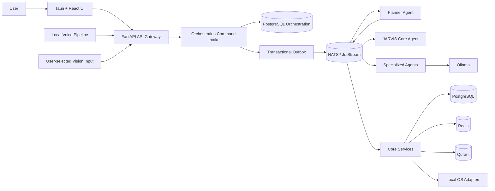
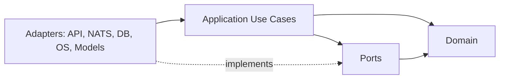
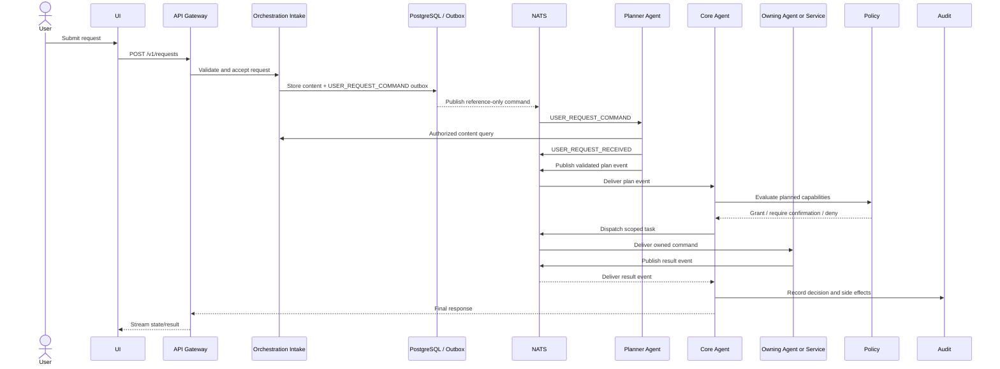

# System Architecture

**Architecture version:** 1.2

This document incorporates the corrections in
`JDOS_v1.2_Architecture_Corrections_Addendum.md`.

Related architecture:

- [`JDOS v1.2 Corrections Addendum`](JDOS_v1.2_Architecture_Corrections_Addendum.md)
- [`Memory Architecture`](memory_architecture.md)
- [`Research Architecture`](research_architecture.md)
- [`Security and Privacy Architecture`](security_privacy.md)

## Architectural Style

JARVIS uses a modular monorepo, clean/hexagonal service internals, and event-driven integration. Domain logic depends on ports, never concrete frameworks. FastAPI, NATS, PostgreSQL, Redis, Qdrant, Ollama, and operating-system adapters sit at the edges.

## Logical Components

### Experience Layer

- **Tauri shell:** native lifecycle, secure command bridge, permissions, and packaging.
- **React application:** Dynamic Island, Orb, command center, notifications, settings, audit, and memory controls.
- **Wallpaper engine:** local visual scenes with strict resource budgets and a disable switch.

### API Gateway

The only frontend-facing backend entry point. It authenticates the local client, validates requests, assigns correlation and idempotency IDs, applies rate limits, and exposes health. For mutations it invokes the Orchestration Command Intake port, which stores sensitive request content in the orchestration schema and atomically writes a reference-only command to an outbox. The Gateway never directly invokes Core, Planner, specialist agents, or another service's database.

### JARVIS Core Agent

Owns request orchestration, planning lifecycle, agent selection, cancellation, user confirmation, and final response composition. It does not own specialist domain data or directly call databases.

The Planner Agent is the single owner of `USER_REQUEST_COMMAND` and operates
under Core governance. Core remains authoritative for lifecycle, policy,
approval, cancellation, and compensation.

### Core Services

- **Memory Service:** source of truth for durable memories, consent, retention, and retrieval.
- **Knowledge Service:** ingestion and provenance for user-approved local documents.
- **Notification Service:** notification lifecycle, priorities, and UI delivery.
- **Settings Service:** user settings, feature flags, runtime configuration, and personal preferences.
- **Policy capability:** centralized authorization for agent tools and sensitive actions.
- **Audit Service:** append-only security, consent, system-action, policy, and administrative history.

### Specialized Agents

Agents are bounded workers, not independent authorities. Each receives a scoped task and capability grant, publishes progress and result events, and cannot broaden its own permissions.

### Infrastructure

- PostgreSQL: durable relational source of truth.
- Redis: ephemeral cache, locks, rate limits, and short-lived coordination.
- Qdrant: derived vector indexes with provenance back to PostgreSQL.
- NATS Core: transient low-latency UI/progress messages.
- NATS JetStream: durable commands and domain events.
- Ollama: local model execution.
- `nomic-embed-text`: approved local embedding model executed through Ollama.

## Command Architecture

Commands request future work and have exactly one owning handler. Events describe
facts that have already occurred and may have multiple subscribers.

| Command | Single owning handler |
|---|---|
| `USER_REQUEST_COMMAND` | Planner Agent |
| `SHOW_NOTIFICATION_COMMAND` | Notification Service |
| `UPDATE_WALLPAPER_COMMAND` | Wallpaper Engine |
| `CREATE_MEMORY_COMMAND` | Memory Service |
| `START_RESEARCH_COMMAND` | Research Agent |
| `OPEN_APPLICATION_COMMAND` | Automation Agent |

Commands use imperative names, expiry, idempotency, and capability grants where
applicable. Successful handling emits factual domain events. A command owner may
delegate through application ports but remains responsible for acknowledgement,
idempotency, and outcome.

## Dependency Rule

Dependencies point inward. Domain modules MUST NOT import FastAPI, NATS, SQLAlchemy, Redis, Qdrant, Ollama, Tauri, or React.

## Service Boundary Rules

- A service owns its schema and mutates it only through its application layer.
- Cross-service reads use an API, event-fed projection, or explicit query service.
- No shared database tables across services.
- Shared packages contain contracts and primitives, not business workflows.
- Every external side effect passes through a named capability port.
- Distributed transactions are prohibited; use local transactions, outbox records, sagas, and compensating actions.
- Cross-boundary mutations use commands. Synchronous internal HTTP is restricted
  to bounded, authenticated, side-effect-free queries and health checks.
- Durable commands and events carry references and metadata only; content is
  retrieved through authorized service query ports.

## Request and Event Flow

## Runtime and Deployment

The baseline is a single-machine deployment:

- Tauri runs as the user-facing process.
- Python services run as supervised local processes or containers.
- Data infrastructure runs through Docker Compose during development.
- Production packaging may use native services or a managed local container runtime, subject to an ADR.
- All listeners bind to loopback by default.
- Outbound network is denied by default and granted only to an explicit, user-enabled adapter.

## Reliability Patterns

- Transactional outbox for durable domain event publication.
- Idempotent consumers keyed by event ID or idempotency key.
- Dead-letter streams with inspection and replay tooling.
- Exponential backoff with jitter and bounded retries.
- Circuit breakers around model, OS, and optional network adapters.
- Readiness checks that include required dependencies; liveness checks remain shallow.
- Correlation and causation IDs propagated across every boundary.
- NATS streams, consumers, retry, dead-letter, replay, size, and sensitive-data
  rules follow the NATS Governance section in the v1.2 addendum.

## Observability

Logs, traces, metrics, and audits remain local. Structured logs use UTC timestamps, service name, severity, event/action name, correlation ID, and redacted fields. Audit records are distinct from diagnostic logs and use tamper-evident chaining.

## Architecture Fitness Checks

CI will eventually enforce:

- Domain code imports no adapter frameworks.
- Event and API schemas validate and remain backward compatible.
- No unapproved outbound network calls.
- No plaintext secrets or sensitive log fields.
- All durable event consumers declare idempotency behavior.
- Core workflows pass with network access blocked.
- Commands have one registered owner and events have registered producers.
- Durable NATS payloads contain no prompts, queries, memory text, documents, or
  raw media.
