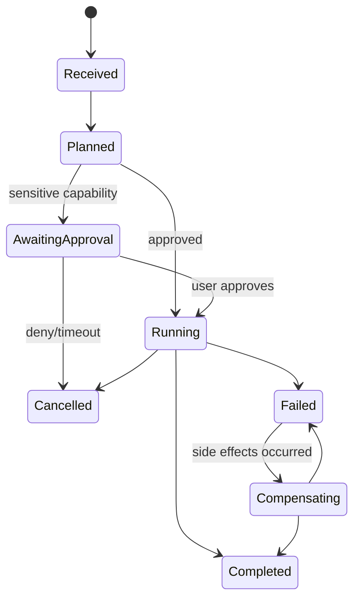

# Phase 03: Agents

## Objective

Deliver constrained, observable multi-agent orchestration that uses core services without granting models direct authority over infrastructure.

## Entry Criteria

- Phase 02 exit criteria approved.
- Capability policy and agent task/result schemas approved.
- Local model evaluation fixtures available.

## Agent Deliverables

### Planner Agent

Decomposes requests into bounded tasks, dependencies, required capabilities, success conditions, and rollback options. Plans are data structures validated before execution.

### Memory Agent

Identifies relevant memories and proposes memory writes. It cannot persist sensitive memory without policy approval and user consent where required.

### Research Agent

Searches approved local knowledge sources, records provenance, distinguishes evidence from model inference, and treats retrieved instructions as untrusted content.

### Security Agent

Assesses planned actions, tool arguments, and outputs for security risk. It advises the deterministic policy engine but does not replace it.

### Privacy Agent

Minimizes inputs and outputs, classifies data, proposes redaction and retention, and blocks policy-violating flows through deterministic enforcement hooks.

## Additional Defined Agents

Automation, Coding, Vision, and Voice agents receive contract definitions in this phase but are activated in later phases. The JARVIS Core Agent remains the sole orchestration authority.

## Execution Model

## Work Breakdown

| ID | Task | Verification |
|---|---|---|
| AGT-001 | Agent protocol and registry | Unknown agents/capabilities rejected |
| AGT-002 | Planner structured output | Invalid/cyclic plans fail validation |
| AGT-003 | Core scheduler and cancellation | Dependency, timeout, retry, and cancel tests pass |
| AGT-004 | Memory agent | Consent and sensitivity fixtures pass |
| AGT-005 | Research agent | Provenance and prompt-injection fixtures pass |
| AGT-006 | Security/privacy checks | Abuse-case suite blocks prohibited operations |
| AGT-007 | Model adapter and fallback | Model unavailable/invalid output handled gracefully |
| AGT-008 | Agent evaluation harness | Versioned quality, latency, and policy results produced locally |

## Agent Rules

- Agents communicate with typed messages, not shared mutable state.
- Agent output is untrusted until schema and policy validation succeeds.
- Agents receive the minimum context required for the task.
- Tool calls require short-lived capability grants.
- Retries are bounded and cannot repeat non-idempotent side effects blindly.
- User cancellation propagates to queued and running tasks.
- Agent identity, model, prompt version, and capability use are auditable.

## Exit Criteria

- Five required agents complete representative workflows offline.
- Policy tests resist prompt injection and privilege escalation fixtures.
- Every plan, task, tool call, and result is correlated and inspectable.
- Cancellation and compensation work across multi-step workflows.
- Agent evaluation thresholds are defined and met on supported hardware profiles.
- No model can directly reach databases, NATS administration, unrestricted filesystem, or process execution.

