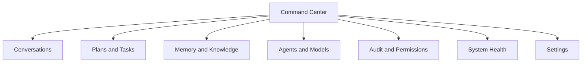

# Phase 05: User Interface

## Objective

Deliver an efficient desktop experience that exposes system state, consent, provenance, memory, and control without hiding automation behind decorative UI.

## Entry Criteria

- Phase 04 exit criteria approved.
- Design tokens, accessibility baseline, and Tauri security configuration reviewed.
- API streaming and notification contracts stable.

## Deliverables

### Dynamic Island

Compact always-available surface for listening, thinking, action approval, progress, completion, errors, and cancellation. It never obscures essential OS controls and is fully keyboard operable.

### JARVIS Orb

State visualization for idle, listening, processing, speaking, attention, and error. Animation honors reduced-motion settings and conveys no state by color alone.

### Command Center

Primary application for conversations, plans, tasks, memories, knowledge sources, agents, notifications, audit, settings, models, storage, and service health.

### Wallpaper Engine

Optional local-rendered background scenes with pause, resource limits, display selection, battery-aware behavior, and a static fallback. It is isolated from assistant permissions and data.

## Information Architecture

## Required States

Every async surface implements loading, empty, partial, success, recoverable error, terminal error, offline, unauthorized, and cancelled states. Optimistic updates are allowed only for reversible UI-local actions.

## Tauri Security Rules

- Content Security Policy denies remote script and content by default.
- Tauri commands are explicit, typed, allowlisted, and argument validated.
- No shell plugin or unrestricted filesystem scope.
- External URLs require user confirmation and OS browser handoff.
- Secrets are never stored in browser storage.

## Work Breakdown

| ID | Task | Verification |
|---|---|---|
| UI-001 | Design system and shell | Responsive, theme, keyboard, and accessibility checks |
| UI-002 | Request/conversation flow | Submit, stream, cancel, retry, provenance tests |
| UI-003 | Dynamic Island and Orb | State machine and multi-display tests |
| UI-004 | Memory/knowledge management | Inspect, edit, export, delete, retention tests |
| UI-005 | Permission and approval UX | Deny, timeout, preview, and audit-link tests |
| UI-006 | Health/settings/models | Missing service/model and recovery paths |
| UI-007 | Notifications | Priority, actions, expiry, and accessibility |
| UI-008 | Wallpaper engine | Resource budget, pause, fallback, and disable tests |

## Exit Criteria

- Core workflows are keyboard accessible and pass automated accessibility checks.
- UI accurately reflects backend state across reconnect and restart.
- Every sensitive capture/action has a clear indicator, preview where practical, and cancellation path.
- Dynamic Island, Orb, command center, and wallpaper controls meet performance budgets.
- Tauri security review has no critical/high findings.
- Visual regression tests cover supported viewport and display profiles.

