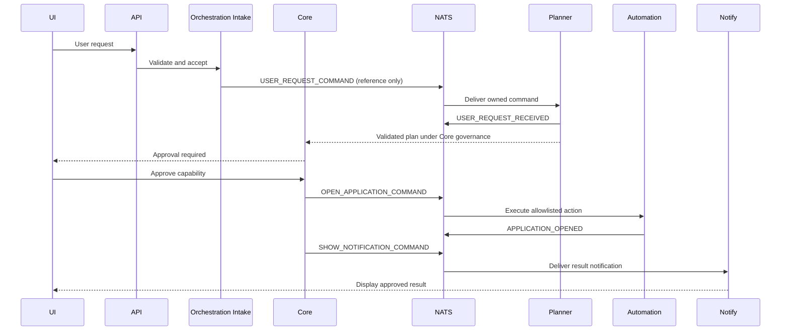

# Phase 06: Integration and Release Readiness

## Objective

Prove that all components operate as one resilient, private, offline system and establish release, upgrade, recovery, and support procedures.

## Entry Criteria

- Phases 01 through 05 have approved exit gates.
- End-to-end acceptance fixtures and supported hardware matrix are defined.
- Release threat model and data migration plan are reviewed.

## End-to-End Workflows

1. Text request to multi-agent plan and final response.
2. Explicit remember, later recall, edit, export, and complete deletion.
3. Local document ingestion, evidence-grounded answer, source removal, and re-index.
4. Wake word to transcription, approval, local action, and spoken result.
5. User-selected visual input to local analysis with ephemeral pixels.
6. Application open automation with preview, capability approval, audit, and cancellation.
7. Notification creation, delivery, action, acknowledgement, and expiry.
8. Service interruption, degraded UI, restart, replay, and recovery.

## Agent Communication Validation

- Contract compatibility across every producer and consumer.
- Idempotent handling under duplicates and redelivery.
- Causation and correlation chains across nested tasks.
- Backpressure and bounded queues under model saturation.
- Cancellation, timeout, retry, dead-letter, replay, and compensation.
- No event contains forbidden sensitive fields.

## Event Flow Example

## Release Engineering Deliverables

- Reproducible signed builds and local SBOM.
- Installer, upgrade, rollback, repair, and uninstall procedures.
- Versioned database/event/API migrations.
- Backup and restore user journey.
- Hardware-specific performance profiles.
- Local diagnostics bundle with explicit user preview and no automatic upload.
- Operator runbooks for every service.

## Validation Matrix

| Area | Required proof |
|---|---|
| Functional | All PRD journeys and failure paths pass |
| Offline | Test suite and manual smoke pass with outbound traffic blocked |
| Privacy | Capture, retention, export, and deletion controls verified |
| Security | Threat model, penetration tests, dependency scans, capability abuse tests |
| Reliability | Restart, crash, duplicate, reorder, disk-full, and dependency-loss tests |
| Performance | Latency, memory, CPU/GPU, disk, and thermal budgets by hardware profile |
| Accessibility | Keyboard, screen reader, contrast, captions, reduced motion |
| Recovery | Backup restored to a clean installation and checksums validated |
| Upgrade | Previous supported release upgrades without data or contract loss |

## Exit Criteria

- Release criteria in the PRD are met.
- Zero unexpected outbound connections occur during an offline acceptance run.
- Critical/high security defects are closed.
- Data export and complete logical deletion pass end to end.
- Recovery point and time objectives are measured and documented.
- Release artifacts are reproducible and installation succeeds on supported systems.
- Known limitations and rollback procedures are documented.
- Architecture, contracts, prompts, and status match the shipped behavior.
