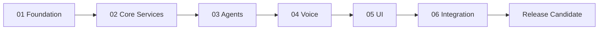

# Development Workflow

## Delivery Model

Work proceeds through six gated phases. A later phase may be explored, but production implementation cannot depend on it until the preceding phase exit gate is approved. Each change should be small, reviewable, reversible, and linked to a requirement, phase task, or ADR.

## Work Item Lifecycle

1. **Select:** Choose one pending task from the active phase.
2. **Context:** Load master context, status, contracts, and applicable ADRs.
3. **Clarify:** Write acceptance criteria and identify security/privacy impact.
4. **Decide:** Create an ADR for a new cross-cutting or costly-to-reverse choice.
5. **Implement:** Follow clean architecture and contract-first development.
6. **Verify:** Run formatting, typing, tests, contract checks, and offline checks.
7. **Review:** Inspect behavior, threat surface, migrations, and observability.
8. **Document:** Update contracts, diagrams, operational notes, and status.
9. **Handoff:** Leave the repository in a reproducible state with explicit next steps.

## Branch and Commit Policy

- Branch names: `feature/<issue>-<slug>`, `fix/<issue>-<slug>`, `docs/<slug>`.
- Commits are atomic and use Conventional Commits.
- Generated files are committed only when required for reproducible builds.
- Do not mix broad refactoring with feature behavior.
- Main must remain buildable and pass required checks.

## Pull Request Checklist

- Requirement and acceptance criteria are linked.
- Public contracts and compatibility impact are identified.
- Tests cover normal, failure, authorization, and idempotency paths.
- Logs contain no secrets or sensitive payloads.
- Migrations include rollback/roll-forward notes.
- Offline operation is tested where applicable.
- Documentation and status are current.
- New dependencies have a license, maintenance, and security review.

## CI Quality Gates

| Gate | Backend | Frontend | Infrastructure/contracts |
|---|---|---|---|
| Format | Ruff formatter | Prettier | Prettier/format validators |
| Lint | Ruff | ESLint | Hadolint, actionlint where applicable |
| Types | Pyright strict | TypeScript strict | Schema generation consistency |
| Unit tests | Pytest | Vitest | Contract tests |
| Integration | Testcontainers/local stack | Component tests | Compose health and migrations |
| Security | Bandit/Semgrep, dependency audit | Dependency audit | Trivy, secret scan, SBOM |
| Architecture | Import boundary checks | Module boundary checks | Event/API compatibility |

Exact tools and versions are pinned during Phase 01.

## Definition of Ready

A task is ready when it has a bounded outcome, acceptance criteria, owner, dependencies, applicable contracts, threat/privacy notes, and a verification method.

## Definition of Done

Done requires passing checks, reviewed implementation, updated documentation, local reproducibility, status update, and no unresolved critical defects. “Works on my machine” without an automated or documented verification is not done.

## AI Agent Handoff Procedure

Before ending a session:

1. Re-read the diff and remove accidental scope.
2. Run the strongest available verification.
3. Update `docs/status/development_status.md`.
4. Record new decisions in an ADR or list them as pending.
5. Include exact commands and outcomes in the session log section.
6. Leave pending tasks ordered by dependency.

The incoming agent must verify the working tree and rerun relevant checks before trusting the handoff.

## Decision Triggers

An ADR is required for:

- New service, datastore, framework, runtime, model, or protocol.
- Changes to architecture constraints or data ownership.
- Security/privacy tradeoffs.
- Breaking API or event changes.
- Deployment and packaging decisions.
- Exceptions to coding or testing standards.

