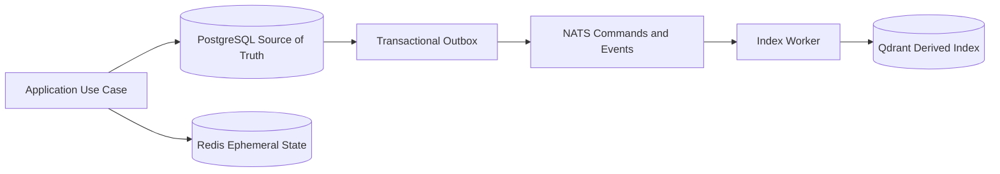
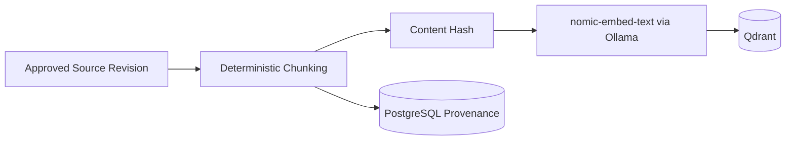
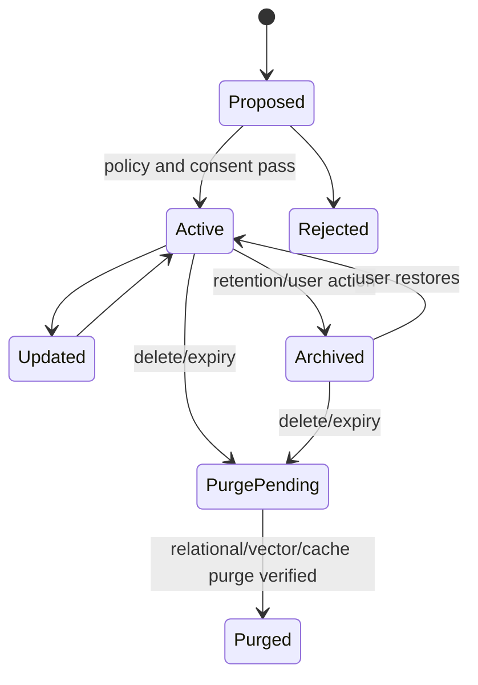

# Database Strategy

**Strategy version:** 1.2

## Principles

PostgreSQL is the durable source of truth, Redis is ephemeral, and Qdrant is a rebuildable semantic index. No datastore is a shortcut around service ownership or policy enforcement.

## PostgreSQL Schema Strategy

- One database per installation, one schema and least-privilege role per service initially.
- Schema names: `memory`, `knowledge`, `notification`, `orchestration`,
  `settings`, and `audit`.
- Shared database extensions and migration metadata live in `platform`.
- The API Gateway owns no business schema. Its command-intake adapter executes
  the Orchestration application use case, which owns request state and outbox
  persistence.
- Services never query or write another service schema directly.
- Primary keys use UUIDv7. Timestamps use `timestamptz`.
- Mutable aggregates include `revision`, `created_at`, and `updated_at`.
- Soft deletion is used only for a documented undo window; privacy deletion requires physical purge after that window.
- JSONB is limited to genuinely variable metadata with schema validation; core query fields remain relational.
- Every durable event-producing transaction writes an outbox row atomically.

Core conceptual tables:

| Schema | Tables |
|---|---|
| `orchestration` | requests, request_content, plans, tasks, capability_grants, inbox, outbox |
| `memory` | memories, memory_revisions, consent_records, retention_jobs, deletion_tombstones, inbox, outbox |
| `knowledge` | sources, documents, chunks, ingestion_jobs, inbox, outbox |
| `notification` | notifications, notification_actions, delivery_state, inbox, outbox |
| `settings` | user_settings, feature_flags, runtime_configuration, preference_revisions, inbox, outbox |
| `audit` | audit_entries, audit_chain_heads |

Sensitive columns are explicitly classified in migrations and excluded from generic debug tooling.

## Redis Usage

Approved uses:

- Short-lived cache of non-authoritative query results.
- Distributed locks/leases with bounded TTL.
- Rate-limit counters.
- Request progress and ephemeral presence.
- Short-lived idempotency acceleration backed by durable inbox state where needed.

Redis MUST NOT store durable memory, source documents, audit history, secrets, raw media, or the only copy of workflow state. Every key has a namespace, owner, serialization version, and TTL. Eviction or total Redis loss must not corrupt durable behavior.

Example key: `jarvis:v1:gateway:rate_limit:<opaque-client-id>`.

## Qdrant Collections

| Collection | Purpose | Source of truth |
|---|---|---|
| `jarvis_memories_v1` | Semantic retrieval of approved memory | `memory.memories` and revisions |
| `jarvis_knowledge_v1` | Semantic retrieval of document chunks | `knowledge.chunks` |

Each point contains an opaque source ID, source revision, content hash, model ID/version, sensitivity, owner scope, and allowed retrieval scopes. Payloads contain minimized text only when required; Restricted content is not embedded by default. Collection names change when vector dimensions or incompatible embedding semantics change.

`nomic-embed-text`, executed locally through Ollama, is the approved embedding
model. Every point or collection manifest records the model name, approved
digest, vector dimensions, chunking version, and index generation. Cloud
embedding APIs and fallback services are prohibited.

### Embedding Pipeline

Re-indexing is resumable, versioned, and uses shadow collections before alias swap. Deleting a source deletes its vectors and verifies absence.

## Memory Lifecycle

Memory records include `memory_id`, `consent_id`, source, content, type,
sensitivity, provenance, confidence, `created_at`, retention policy, expiry,
and revision. Automatic inference-based memory creation is disabled by default.
Restricted values such as credentials are rejected and redirected to the OS
credential manager when appropriate.

## Memory Consent Architecture

The `memory.consent_records` table contains:

| Field | Purpose |
|---|---|
| `consent_id` | UUIDv7 identifier |
| `subject_id` | Local user identity |
| `purpose` | Specific approved memory purpose |
| `scope` | Allowed memory types and sources |
| `status` | `active`, `revoked`, or `expired` |
| `granted_at` | Approval timestamp |
| `expires_at` | Optional expiry |
| `revoked_at` | Optional revocation timestamp |
| `request_id` | Originating request |
| `policy_version` | Consent-policy version |

Consent creation and memory creation may occur in one Memory Service transaction
only when the API carries an explicit current user approval. Revocation blocks
retrieval immediately and starts an idempotent purge job for records that have
no other valid consent basis. Consent decisions and purge outcomes are recorded
in the Audit Service without memory content.

## Settings Service Ownership

The Settings Service exclusively owns the `settings` schema and the validated
values for user settings, feature flags, runtime configuration, and personal
preferences. Secrets are stored in the OS credential manager; settings retain
only opaque secret references. Safety policy floors cannot be changed through
ordinary settings.

## Audit Service Ownership

The Audit Service exclusively writes `audit.audit_entries` and
`audit.audit_chain_heads`. Entries are append-only, hash chained, and
content-minimized. Agents have no general read access. The local authenticated
user can query redacted records. Retention is configurable above a security
minimum, and mandatory audit-write failure causes sensitive actions to fail
closed.

## Retention and Deletion

- Retention policies: session, fixed expiry, until deleted, or user-defined.
- A local scheduler discovers expired records and initiates idempotent purge jobs.
- Purge order: revoke access, delete vectors, invalidate caches, remove derived artifacts, delete/cryptographically erase relational content, record a content-free audit fact.
- Backups expire deleted content according to the documented backup retention window; restore procedures reapply deletion tombstones before restored data becomes available.
- The UI shows deletion state and expected backup expiry.

## Migrations

- Each service owns ordered forward migrations.
- Production migrations are reviewed, backed up, and tested against the previous supported release.
- Expand/contract changes preserve compatibility during rolling local process restarts.
- Destructive migrations require an ADR, backup, verification query, and recovery plan.
- Application startup does not silently run destructive migrations.

## Backup and Restore

- Back up PostgreSQL, Qdrant snapshots, user settings, consent records, and
  consent-backed memory data. Qdrant may also be rebuilt from PostgreSQL when
  snapshot compatibility fails.
- Exclude Redis, API keys, tokens, secrets, credentials, `.env` files, OS
  credential-manager contents, caches, and temporary media.
- Backups are encrypted locally using authenticated encryption with a
  user-controlled recovery key that is not stored in the backup. Backups are
  written only to a user-selected local path.
- Use checksums, manifests, application version, schema versions, and model/index metadata.
- Default retention proposal: 7 daily, 4 weekly, 3 monthly; user configurable.
- Restore occurs into an isolated target and validates encryption, manifest
  authenticity, checksums, schema migrations, model/index compatibility,
  deletion tombstones, and consent revocations before atomic switchover.
- Quarterly restore drills are required after release.

Initial objectives: RPO 24 hours with daily backup and RTO 2 hours on supported hardware. Phase 06 measures and revises these targets.
